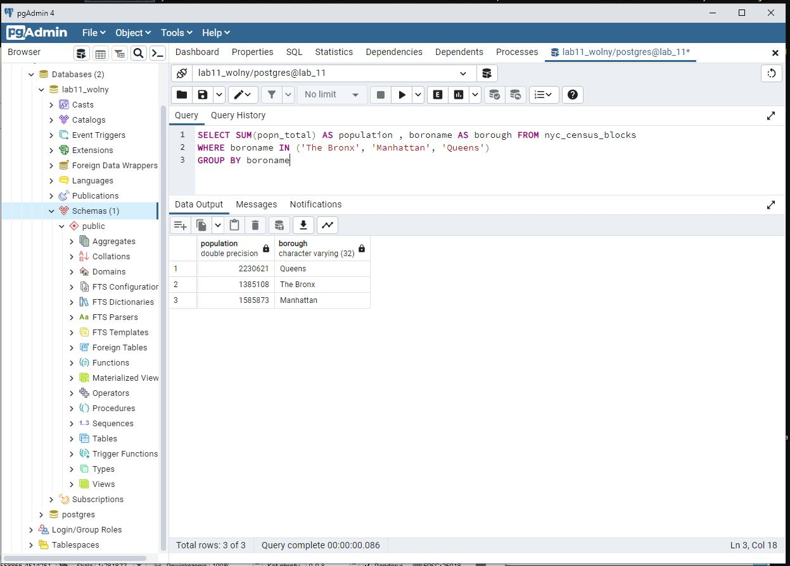

### 1. Ile rekordów znajduje się w tabeli nyc_streets?

### 2. Ile ulic w Nowym Jorku ma nazwy zaczynające się na „B”, „Q” i „M”?

### 3. Jaka jest populacja miasta Nowy Jork?

### 4. Jaka jest populacja Bronxu, Manhattanu i Queens?

### 5. Ile dzielnic ("neighborhoods") znajduje się w każdej gminie (borough)?

