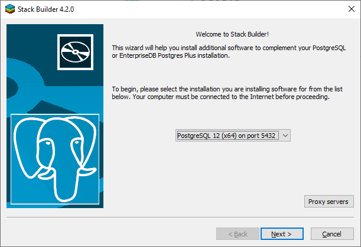
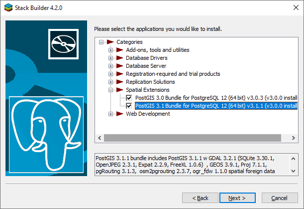
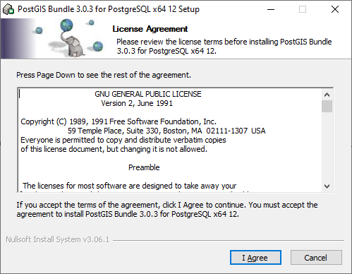
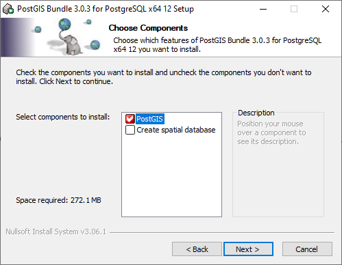
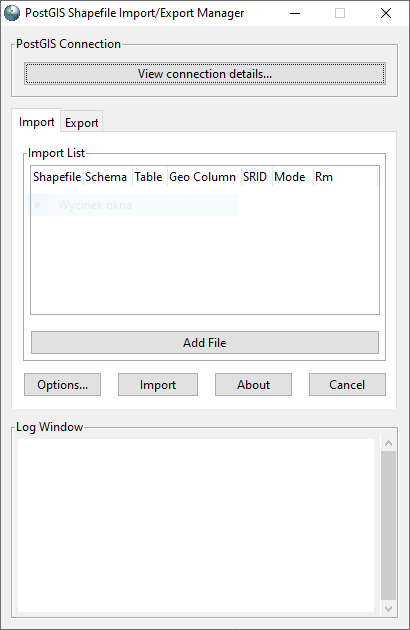
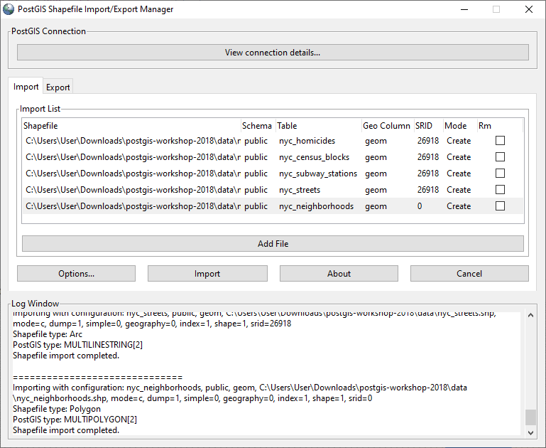
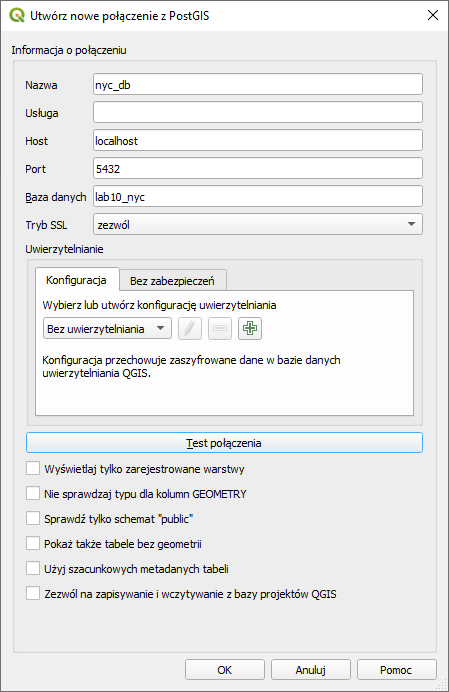

# Baza danych przestrzennych/PostGIS
Przestrzenna baza danych to baza danych zoptymalizowana pod kątem przechowywania i wykonywania zapytań dotyczących danych reprezentujących obiekty geometryczne. Większość baz danych przestrzennych umożliwia reprezentację prostych obiektów geometrycznych, takich jak punkty, linie i wielokąty. Niektóre bazy danych przestrzennych obsługują bardziej złożone struktury, takie jak obiekty 3D, pokrycia topologiczne, sieci liniowe itp.

Open Geospatial Consortium (OGC) opracowało specyfikację Simple Features (po raz pierwszy wydaną w 1997 r.) i wyznaczył standardy dodawania przestrzennej funkcjonalności do systemów baz danych. Standard SQL/MM Spatial ISO/IEC jest częścią standardu multimedialnego SQL/MM i rozszerza standard Simple Features.

### Przykładowa baza danych
Na zajęciach użyjemy bazy danych opisującej Nowy York [(data)](http://s3.cleverelephant.ca/postgis-workshop-2018.zip).

Zbiór ten zawiera publicznie dostępne informacje na temat:
- Bloki
- dzielnice
- ulice
- pod ziemią
- dane populacyjne.

### Instalacja PostGIS na serwerze PostgreSQL

#### Ubuntu
Wykonaj polecenie:

```
sudo apt-get install postgis
```

#### Windows
1. Otwórz *PostgreSQL Application Stack Builder*.

2. Wybierz serwer, na którym chcesz zainstalować PostGIS.



3. W sekcji *Spatial Extensions* wybierz wersję PostGIS do zainstalowania.



4. Wybierz ścieżkę do pobrania pliku instalacyjnego.

5. Przed instalacją PostGIS zamknij PgAdmin.

6. Zainstaluj PostGIS.
	1. Potwierdź licencje:

	

	2. Zainstaluj tylko PostGIS

	
	
	
### Utwórz bazę danych przestrzennych
Użytkownik i hasło do lokalnej bazy danych to *postgres*

1. Stwórz bazę danych przy pomocy psql lub PgAdmina z ustawieniami \([pomoc](https://www.postgresqltutorial.com/connect-to-postgresql-database/)\):
	- Baza danych: lab11_nyc
	- Właściciel: postgres


2. Otwórz w terminalu lab11_nyc

3. Dodaj rozszerzenie przestrzenne do tej bazy danych za pomocą zapytania:
``` sql
CREATE EXTENSION postgis;

```
4. Potwierdź, że PostGIS jest zainstalowany, uruchamiając funkcję PostGIS:

``` sql
select postgis_full_version();
```

Spodziewany wynik:
```
POSTGIS="3.1.1 3.1.1" [EXTENSION] PGSQL="120" GEOS="3.9.1-CAPI-1.14.1" PROJ="7.1.1" LIBXML="2.9.9" LIBJSON="0.12" LIBPROTOBUF="1.2.1" WAGYU="0.5.0 (inter)"
```

### Importuj dane przestrzenne do bazy danych

#### Ubuntu
1. 
```
export PGPASSWORD= haslo_do_bazy
```

2. Wczytanie pojedynczego pliku kształtu:
```
shp2pgsql \
  -D \
  -I \
  -s 26918 \
  nyc_census_blocks.shp \
  nyc_census_blocks \
  | psql -h localhost -d mydatabase -U postgres -p <port>
```

#### Windows
1. Otwórz aplikację *PostGIS Shapefile Import/Export Manager*



2. Zainicjuj połączenie z lab10_nyc za pomocą *View connection details...*
3. *Add File* z pobranego zestawu  [data](http://s3.cleverelephant.ca/postgis-workshop-2018.zip) z rozszerzeniem shp ( z katalogu data).

Plik kształtu (shp) to prosty, nietopologiczny format do przechowywania położenia geometrycznego i informacji o atrybutach obiektów geograficznych. Cechy geograficzne w pliku kształtu mogą być reprezentowane przez punkty, linie lub wielokąty (obszary). Obszar roboczy zawierający pliki shape może również zawierać tabele dBASE, które mogą przechowywać dodatkowe atrybuty, które można połączyć z funkcjami pliku kształtu.
Obowiązkowe pliki:

- .shp — opisuje geometrię,
- .shx — indeks kształtu - pozycyjny indeks geometrii.
- .dbf — atrybuty kolumnowe dla każdego kształtu w standardzie dBase III

Pliki opcjonalne obejmują:

- .prj — układ współrzędnych i informacje o odwzorowaniu, zwykły plik tekstowy opisujący odwzorowanie przy użyciu znanego formatu tekstowego

4. Ustaw dane jak na obrazku:



5. *Import* dane do bazy danych.
6. Sprawdź wynik działania w PgAdmin


## Wyświetl dane geometryczne

### QGIS

QGIS to system informacji geograficznej o otwartym kodzie źródłowym. Projekt narodził się w maju 2002 roku i powstał jako projekt na SourceForge w czerwcu tego samego roku. Ciężko pracowaliśmy, aby oprogramowanie GIS (które jest tradycyjnie drogim oprogramowaniem własnościowym) było dostępne dla każdego, kto ma dostęp do komputera osobistego. QGIS działa obecnie na większości platform Unix, Windows i macOS. QGIS jest rozwijany przy użyciu zestawu narzędzi Qt (https://www.qt.io) i C++. Oznacza to, że QGIS jest zgryźliwy i ma przyjemny, łatwy w użyciu graficzny interfejs użytkownika (GUI).

QGIS ma być przyjaznym dla użytkownika systemem GIS, zapewniającym wspólne funkcje i cechy. Pierwotnym celem projektu było dostarczenie przeglądarki danych GIS. QGIS osiągnął punkt ewolucji, w którym jest używany do codziennych potrzeb przeglądania danych GIS, do przechwytywania danych, do zaawansowanej analizy GIS oraz do prezentacji w postaci wyrafinowanych map, atlasów i raportów. QGIS obsługuje bogactwo formatów danych rastrowych i wektorowych, a obsługa nowych formatów jest łatwa do dodania dzięki architekturze wtyczek.

#### Połączenie z bazą danych PostGIS

1. Otwórz QGIS.
2. W sekcji *Eksploruj* kliknij drugim przyciskiem myszy na PostGIS.
3. Dodaj nowy formularz ustawień połączenia po drodze na obrazie.
4.


4. Po połączeniu otwórz warstwę bazy danych PostGIS w QGIS.


##Ćwiczenia:

1. Ile rekordów znajduje się w tabeli nyc_streets?
2. Ile ulic w Nowym Jorku ma nazwy zaczynające się na „B”, „Q” i „M”?
3. Jaka jest populacja miasta Nowy Jork?
4. Jaka jest populacja Bronxu, Manhattanu i Queens?
5. Ile dzielnic ("neighborhoods") znajduje się w każdej gminie (borough)?

#Materiały uzupełniające
1. [PostGIS workshops](https://postgis.net/workshops/postgis-intro/index.html)
2. [Qgis](https://qgis.org/pl/site/)